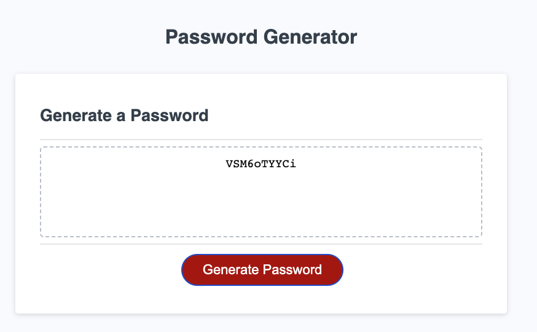

# Password Generator

## Description
 
This is Challenge 5 of the Front-End Web Developer bootcamp. The instruction is to create an application that an employee can use to generate a random password based on criteria they’ve selected by modifying starter code. 

when clicking on the Generate Password button, a series of prompts will be presented to the user:

* Length of password (between 10 and 64 characters)
* Whether the password should include the below types:
  * Lowercase 
  * Uppercase
  * Numeric
  * Special characters ($@%&*, etc)

At least one of the character types must be selected.

The programme then returns a password based on options chosen by the user.

The deployed application can be found [here](https://helenesauve.github.io/Password-Generator/) and looks like the below screenshot:

